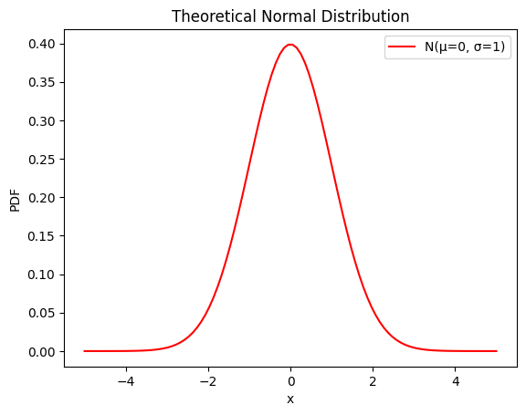
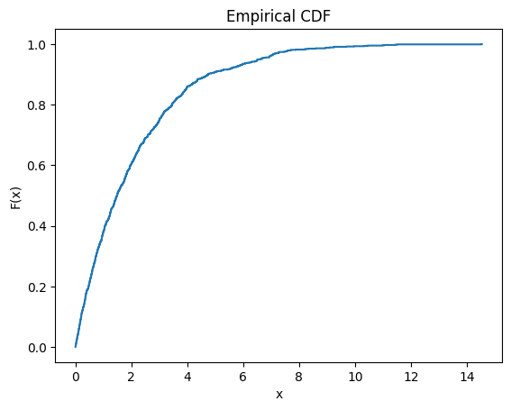

<script type="text/javascript" async
  src="https://cdnjs.cloudflare.com/ajax/libs/mathjax/3.2.0/es5/tex-mml-chtml.js">
</script>

# How Businesses Use Data: Methods & Distributions

---

## 1. **Trace-Driven Simulation**
**Definition**: Use raw historical data directly in simulations.  
**Use Case**: Replicating real-world scenarios (e.g., customer arrivals, sales data).  

### Real-World Examples:
1. **Call Center Operations**:
   - Using historical call logs to simulate peak hours
   - Data includes: call duration, arrival times, service times
   - Example: `call_data = [(9:00, 3min), (9:05, 4min), ...]`

2. **Bank Queue Management**:
   ```python
   # Sample trace-driven simulation
   import pandas as pd
   
   historical_data = pd.DataFrame({
       'arrival_time': ['9:00', '9:05', '9:10'],
       'service_time': [5, 3, 4],
       'teller_id': [1, 2, 1]
   })
   
   def simulate_queue(data):
       # Simulation logic using real data
       return waiting_times
   ```

### Implementation Tips:
- Store historical data in proper time series format
- Account for seasonality and special events
- Clean data to remove anomalies

### **Drawbacks**:
- Limited to historical data patterns.
- Cannot model **rare events** (e.g., Black Friday-level demand).
- Data may contain noise or biases.

---

## 2. **Theoretical Distribution Fitting**
**Definition**: Fit a known mathematical distribution to observed data.  
**Common Distributions**:  
- Normal: $$X \sim \mathcal{N}(\mu, \sigma^2)$$  
- Exponential: $$f(x) = \lambda e^{-\lambda x}$$  
- Poisson: $$P(k) = \frac{\lambda^k e^{-\lambda}}{k!}$$  

### **Advantages**:
- Smooths irregularities in data (e.g., removes noise).
- Extrapolates beyond observed data (e.g., predict extreme values).  

### **Process**:
1. **Parameter Estimation**: Use methods like Maximum Likelihood Estimation (MLE).  
   Example: For normal distribution, estimate $$\mu = \frac{1}{n}\sum X_i$$ and $$\sigma^2 = \frac{1}{n}\sum (X_i - \mu)^2$$.  
2. **Goodness-of-Fit Tests**: Validate with metrics like Kolmogorov-Smirnov (KS) test.  

### Practical Applications:

1. **Customer Purchase Analysis**:
```python
from scipy import stats

# Fit customer spending data to log-normal distribution
spending_data = [45, 65, 32, 78, 90, 42, 65]
params = stats.lognorm.fit(spending_data)
print(f"Distribution parameters: {params}")

# Calculate probability of purchase > $100
prob_high_purchase = 1 - stats.lognorm.cdf(100, *params)
```

2. **Manufacturing Quality Control**:
```python
# Tolerance limits using normal distribution
measurements = np.random.normal(100, 2, 1000)  # parts dimensions
mean, std = np.mean(measurements), np.std(measurements)
lower_limit = mean - 3*std
upper_limit = mean + 3*std

print(f"Control limits: {lower_limit:.2f} to {upper_limit:.2f}")
```

### Distribution Selection Guide:
| Data Type | Recommended Distribution | Example Use Case |
|-----------|------------------------|------------------|
| Wait Times | Exponential | Customer service queues |
| Sales | Log-normal | Daily revenue analysis |
| Defects | Poisson | Quality control |
| Measurements | Normal | Product specifications |

### Example:
Modeling insurance claim amounts using an exponential distribution with $$\lambda = 0.1$$.

---

## 3. **Empirical Distribution**
**Definition**: Build a custom distribution directly from observed data.  

### **Ungrouped Data**:
1. Sort data: $$X_{(1)} \leq X_{(2)} \leq \cdots \leq X_{(n)}$$.  
2. **CDF Formula**:  
   $$
   F(x) = \frac{\text{number of observations} \leq x}{n}
   $$  
   This creates a stepwise CDF.  

### **Grouped Data**:
For intervals (e.g., $$[a_0, a_1), [a_1, a_2), \dots$$):  
**CDF Formula** (Piecewise linear):  
$$
F(x) = 
\begin{cases}
0 & \text{if } x < a_0, \\
F(a_{i-1}) + \frac{x - a_{i-1}}{a_i - a_{i-1}} \cdot p_i & \text{if } x \in [a_{i-1}, a_i), \\
1 & \text{if } x \geq a_k.
\end{cases}
$$  
where $$p_i$$ is the probability of interval $$i$$.  

### Advanced Applications:

1. **Bootstrap Sampling**:
```python
def bootstrap_mean(data, n_samples=1000):
    means = []
    for _ in range(n_samples):
        sample = np.random.choice(data, size=len(data), replace=True)
        means.append(np.mean(sample))
    return np.percentile(means, [2.5, 97.5])  # 95% CI
```

2. **Kernel Density Estimation**:
```python
from scipy.stats import gaussian_kde

# Smooth empirical distribution
data = np.random.lognormal(0, 0.5, 1000)
kde = gaussian_kde(data)
x_grid = np.linspace(min(data), max(data), 100)
density = kde(x_grid)

plt.plot(x_grid, density)
plt.title('Smoothed Empirical Distribution')
plt.show()
```

### **Limitations**:
- Cannot generate values outside the observed range.  
- Irregularities persist with small datasets.  

### Example:
Modeling restaurant wait times using empirical data collected over a month.

---

## **Comparison of Approaches**

| Factor                | Theoretical Distribution (Approach 2) | Empirical Distribution (Approach 3) |
|-----------------------|----------------------------------------|--------------------------------------|
| **Extrapolation**     | ✅ Possible (e.g., extreme values)     | ❌ Not possible                      |
| **Smoothness**        | ✅ Smooth                              | ❌ Irregular with small data         |
| **Use Case**          | Generalizing trends                    | Replicating exact scenarios          |

---

## **Visualization Examples**

### 1. Theoretical Distribution (Normal)
**Python Code**:
```python
import numpy as np
import matplotlib.pyplot as plt
from scipy.stats import norm

mu, sigma = 0, 1
x = np.linspace(-5, 5, 100)
pdf = norm.pdf(x, mu, sigma)

plt.plot(x, pdf, 'r-', label=f'N(μ={mu}, σ={sigma})')
plt.title('Theoretical Normal Distribution')
plt.xlabel('x')
plt.ylabel('PDF')
plt.legend()
plt.show()
```



### 2. Empirical Distribution (Stepwise CDF)
**Python Code**:
```python
import numpy as np
import matplotlib.pyplot as plt

data = np.random.exponential(scale=2, size=1000)
sorted_data = np.sort(data)
y = np.arange(1, len(sorted_data)+1) / len(sorted_data)

plt.step(sorted_data, y, where='post')
plt.title('Empirical CDF')
plt.xlabel('x')
plt.ylabel('F(x)')
plt.show()
```

### Visual Comparisons:

Add these plots to demonstrate distribution comparisons:

1. **Theoretical vs Empirical Fit**:
```python
def plot_distribution_comparison(data, dist_name='normal'):
    # Plot empirical vs fitted theoretical distribution
    plt.figure(figsize=(10, 6))
    
    # Empirical distribution
    plt.hist(data, density=True, alpha=0.5, label='Empirical')
    
    # Fitted theoretical distribution
    if dist_name == 'normal':
        mu, std = stats.norm.fit(data)
        x = np.linspace(min(data), max(data), 100)
        p = stats.norm.pdf(x, mu, std)
        plt.plot(x, p, 'r-', label=f'Fitted Normal(μ={mu:.2f}, σ={std:.2f})')
    
    plt.title('Empirical vs Theoretical Distribution')
    plt.legend()
    plt.show()
```



---

## **When to Use Each Method?**

| Method                  | Best For                                   | Avoid When                          |
|-------------------------|--------------------------------------------|-------------------------------------|
| **Trace-Driven**        | Replicating exact historical scenarios     | Modeling rare/unobserved events     |
| **Theoretical**         | Generalizing trends, predicting extremes   | Data doesn’t fit known distributions|
| **Empirical**           | Small datasets, exact replication          | Extrapolation needed                |

## **Advanced Topics and Extensions**

### 1. **Mixture Models**:
When data comes from multiple sources:
```python
from sklearn.mixture import GaussianMixture

# Fit mixture of two normal distributions
gmm = GaussianMixture(n_components=2)
gmm.fit(data.reshape(-1, 1))
```

### 2. **Time Series Components**:
```python
from statsmodels.tsa.seasonal import seasonal_decompose

# Decompose time series into trend, seasonal, and residual
result = seasonal_decompose(data, period=12)
result.plot()
```

