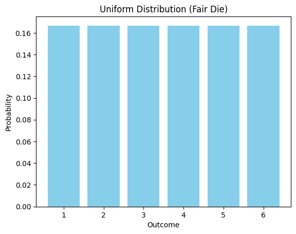
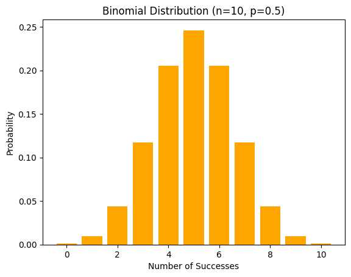
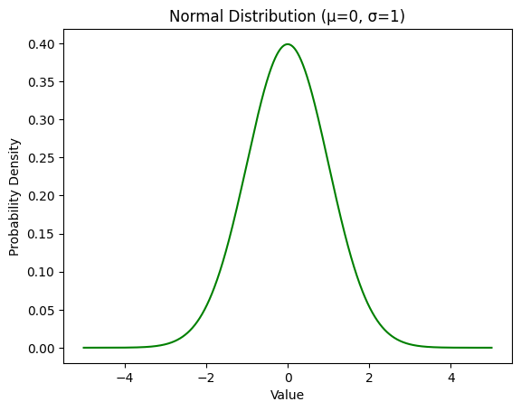
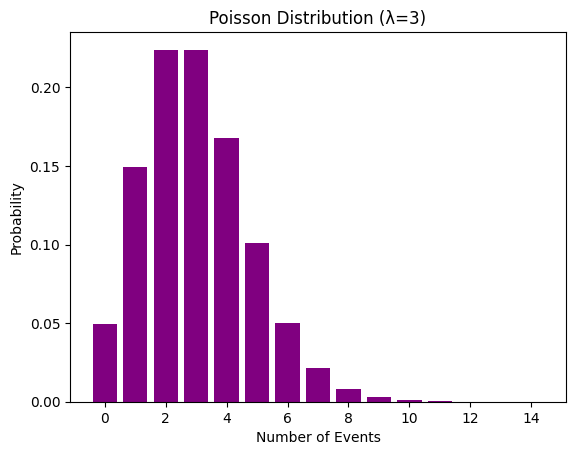

<script type="text/javascript" async
  src="https://cdnjs.cloudflare.com/ajax/libs/mathjax/3.2.0/es5/tex-mml-chtml.js">
</script>

# Probability Distribution 

## What is a Probability Distribution?

A **probability distribution** is a statistical function that describes all the possible values and likelihoods that a random variable can take within a given range. It provides a comprehensive view of the probabilities associated with the outcomes of a random experiment.

- **Random Variable**: A variable whose possible values are outcomes of a random phenomenon.
- **Discrete Distribution**: The random variable can take on only distinct, separate values (e.g., number of heads in coin flips).
- **Continuous Distribution**: The random variable can take on any value within a range (e.g., height, weight).

---

## Real-World Analogy

Imagine you are rolling a six-sided die:
- Each face (1 to 6) has an equal probability of landing face up.
- The probability distribution for this die is uniform, meaning each outcome has a probability of $$\frac{1}{6}$$.


In real life, probability distributions help us model and predict outcomes, such as:
- The likelihood of rain on a given day.
- The distribution of heights in a population.
- The number of customers arriving at a store in an hour.

---

## Why Probability Distribution Matters

1. **Predictive Analysis**: Helps in forecasting future events based on historical data.
2. **Decision Making**: Provides a framework for making informed decisions under uncertainty.
3. **Statistical Inference**: Forms the basis for hypothesis testing, confidence intervals, and regression analysis.
4. **Risk Assessment**: Used in finance, insurance, and engineering to quantify risk.

---

## Examples of Probability Distributions

### 1. **Uniform Distribution**
   - All outcomes are equally likely.
   - Example: Rolling a fair die.
   - **Graph Code**:
     ```python
     import numpy as np
     import matplotlib.pyplot as plt

     outcomes = np.arange(1, 7)
     probabilities = np.ones(6) / 6

     plt.bar(outcomes, probabilities, color='skyblue')
     plt.title('Uniform Distribution (Fair Die)')
     plt.xlabel('Outcome')
     plt.ylabel('Probability')
     plt.show()
     ```



### 2. **Binomial Distribution**
   - Models the number of successes in a fixed number of trials.
   - Example: Number of heads in 10 coin flips.
   - **Graph Code**:
     ```python
     from scipy.stats import binom

     n = 10  # Number of trials
     p = 0.5  # Probability of success (e.g., heads)

     x = np.arange(0, n+1)
     probabilities = binom.pmf(x, n, p)

     plt.bar(x, probabilities, color='orange')
     plt.title('Binomial Distribution (n=10, p=0.5)')
     plt.xlabel('Number of Successes')
     plt.ylabel('Probability')
     plt.show()
     ```



### 3. **Normal Distribution (Gaussian)**
   - Symmetric distribution around the mean.
   - Example: Distribution of heights in a population.
   - **Graph Code**:
     ```python
     from scipy.stats import norm

     mu = 0  # Mean
     sigma = 1  # Standard deviation

     x = np.linspace(-5, 5, 1000)
     probabilities = norm.pdf(x, mu, sigma)

     plt.plot(x, probabilities, color='green')
     plt.title('Normal Distribution (μ=0, σ=1)')
     plt.xlabel('Value')
     plt.ylabel('Probability Density')
     plt.show()
     ```



### 4. **Poisson Distribution**
   - Models the number of events occurring in a fixed interval.
   - Example: Number of emails received in an hour.
   - **Graph Code**:
     ```python
     from scipy.stats import poisson

     lambda_ = 3  # Average rate of occurrence

     x = np.arange(0, 15)
     probabilities = poisson.pmf(x, lambda_)

     plt.bar(x, probabilities, color='purple')
     plt.title('Poisson Distribution (λ=3)')
     plt.xlabel('Number of Events')
     plt.ylabel('Probability')
     plt.show()
     ```



---

## Summary Table of Common Distributions

| Distribution   | Type        | Example Use Case                     |
|----------------|-------------|---------------------------------------|
| Uniform        | Discrete    | Rolling a fair die                   |
| Binomial       | Discrete    | Number of heads in coin flips        |
| Normal         | Continuous  | Heights of people                    |
| Poisson        | Discrete    | Number of emails received in an hour |


