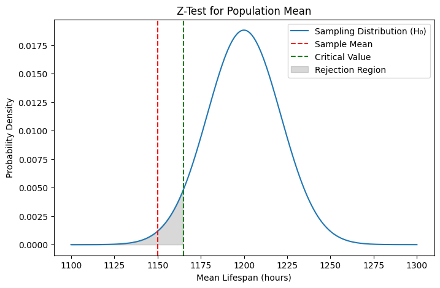

<script type="text/javascript" async
  src="https://cdnjs.cloudflare.com/ajax/libs/mathjax/3.2.0/es5/tex-mml-chtml.js">
</script>

# Hypothesis Testing Fundamentals

Hypothesis testing is a statistical method used to make inferences about a population based on sample data. It evaluates two competing hypotheses to determine if there is sufficient evidence to reject the null hypothesis in favor of the alternative.

---

## **Key Concepts**

### 1. **Null Hypothesis (H₀)**
   - The default assumption that there is **no effect** or **no difference**.
   - Example: *"The mean height of men and women is equal."*

### 2. **Alternative Hypothesis (H₁)**
   - The claim we aim to validate, suggesting **there is an effect** or **difference**.
   - Example: *"The mean height of men is greater than that of women."*

### 3. **Significance Level (α)**
   - The probability of rejecting H₀ when it is true (**Type I Error**).
   - Common values: 0.05 (5%) or 0.01 (1%).

### 4. **p-value**
   - Probability of observing the sample data (or more extreme) **assuming $$H_0$$ is true**.
   - **Decision Rule:** Reject $$H_0$$ if $$p\text{-value} < \alpha$$.

### 5. **Test Statistic**
   - A standardized value (e.g., z-score, t-score) calculated from sample data to compare against a critical value.

### 6. **Type I vs. Type II Errors**
   - **Type I Error (False Positive):** Rejecting H₀ when it is true.
   - **Type II Error (False Negative):** Failing to reject H₀ when it is false.

---

## **Steps in Hypothesis Testing**
1. **State Hypotheses:** Define H₀ and H₁.
2. **Choose Significance Level (α):** Typically 0.05.
3. **Select Appropriate Test:** e.g., z-test, t-test, chi-square.
4. **Calculate Test Statistic:** Use sample data.
5. **Determine Critical Value or p-value:**
   - Compare the test statistic to a critical value from statistical tables.
   - Alternatively, calculate the p-value.
6. **Make a Decision:** Reject H₀ if the test statistic falls in the rejection region or $$ p\text{-value} < \alpha $$.

---

## **Types of Tests**
### 1. **Parametric Tests**
   - Assume data follows a specific distribution (e.g., normal).
   - Examples: z-test, t-test, ANOVA.

### 2. **Non-Parametric Tests**
   - No distributional assumptions.
   - Examples: Mann-Whitney U test, Wilcoxon signed-rank test.

### 3. **One-Tailed vs. Two-Tailed Tests**
   - **One-Tailed:** Tests for effect in **one direction** (e.g., $$\mu > \mu_0$$).
   - **Two-Tailed:** Tests for effect in **both directions** (e.g., $$\mu \neq \mu_0$$).

---

## **Example: Z-Test for Population Mean**
### **Scenario**
A company claims its light bulbs last 1200 hours. A sample of 50 bulbs has a mean lifespan of 1150 hours with a known population standard deviation of 150 hours. Test if the mean lifespan is less than 1200 hours at $$\alpha = 0.05$$.

### **Hypotheses**

$$H_0: \mu = 1200$$
$$H_1: \mu < 1200$$

### **Python Code**
```python
import numpy as np
from scipy.stats import norm
import matplotlib.pyplot as plt

# Parameters
sample_mean = 1150
pop_mean = 1200
pop_std = 150
n = 50
alpha = 0.05

# Calculate z-score
z_score = (sample_mean - pop_mean) / (pop_std / np.sqrt(n))
p_value = norm.cdf(z_score)  # Left-tailed test

print(f"Z-Score: {z_score:.2f}")
print(f"P-value: {p_value:.4f}")

# Decision
if p_value < alpha:
    print("Reject H₀: Evidence suggests mean lifespan < 1200 hours.")
else:
    print("Fail to reject H₀: No evidence against the claim.")

# Visualization
x = np.linspace(1100, 1300, 400)
y = norm.pdf(x, loc=pop_mean, scale=pop_std/np.sqrt(n))
critical_value = pop_mean + norm.ppf(alpha) * (pop_std/np.sqrt(n))

plt.figure(figsize=(8, 5))
plt.plot(x, y, label='Sampling Distribution (H₀)')
plt.axvline(sample_mean, color='red', linestyle='--', label='Sample Mean')
plt.axvline(critical_value, color='green', linestyle='--', label='Critical Value')
plt.fill_between(x, y, where=(x <= critical_value), color='gray', alpha=0.3, label='Rejection Region')
plt.xlabel('Mean Lifespan (hours)')
plt.ylabel('Probability Density')
plt.title('Z-Test for Population Mean')
plt.legend()
plt.show()
```

---

## **Output Interpretation**
- **Z-Score:** -3.33 (standard deviations from the mean under $$H_0$$).
- **P-value:** 0.0004 (probability of observing a sample mean ≤ 1150 if $$H_0$$ is true).
- **Conclusion:** Since $$p\text{-value} < 0.05$$, reject $$H_0$$. The data suggests the mean lifespan is less than 1200 hours.

---

## **Visualization**
  
*(Actual plot shows sampling distribution under H₀, rejection region, and sample mean.)*

---

## **Common Misconceptions**
1. **"p-value is the probability $$H_0$$ is true":** Incorrect. p-value measures data compatibility with $$H_0$$.
2. **"Statistical significance implies practical importance":** Not necessarily. Large samples may detect trivial effects.

---

## **Limitations**
- **Sample Size Sensitivity:** Large samples may trivialize small differences.
- **Assumption Violations:** Incorrect conclusions if test assumptions (e.g., normality) are unmet.

---

## **Conclusion**
Hypothesis testing is a cornerstone of statistical inference, enabling data-driven decisions in research, business, and policy. Proper application requires understanding its principles, assumptions, and limitations.
